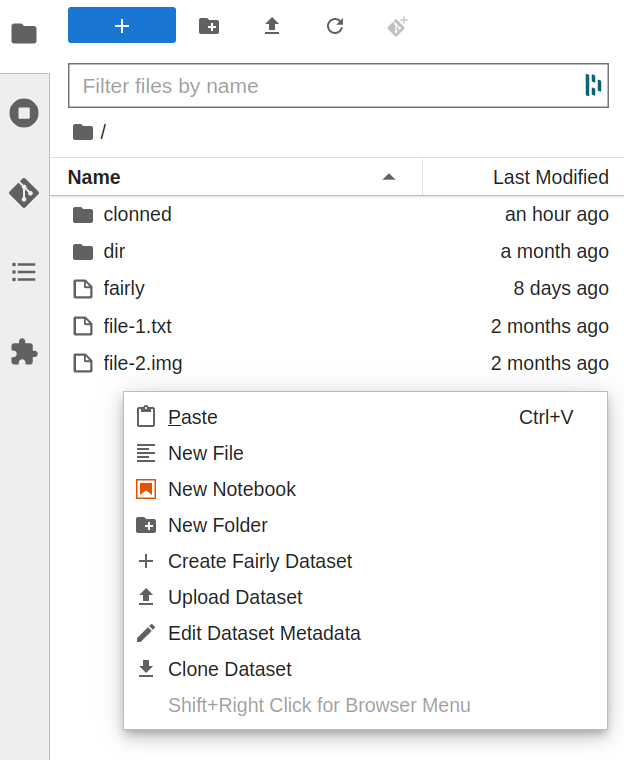

# JupyterFAIR
 A jupyterLab extension for seamless integration of Jupyter-based research environments and research data repositories.

## Set up Dev Environment

1. Create a conda environment with
    ```shell
    conda create -n jupyterfair --override-channels --strict-channel-priority -c conda-forge -c nodefaults jupyterlab=3 cookiecutter nodejs jupyter-packaging git
    ```
2. Clone repository
3. Activate conda environment
4. Create a `config.json` and store it in `~/.fairly`.
5. Copy the example below to `config.json`. You must add the tokens for your repository accounts
   ```json
   {
        "fairly": {
                "orcid_client_id":"APP-IELS3LR4OCLHLELC",
                "orcid_clien_secret": "",
                "orcid_token": ""
        },
        "4tu": {
        "token": "<your-token>"
        },
        "zenodo": {
        "token":"<your-token>"
        }
    }
   ```
6. Go to `jupyterfair` directory, and install, activate and build extension
    ```shell
    # Link your development version of the extension with JupyterLab
    jupyter labextension develop . --overwrite
    # Enable the server extension
    jupyter server extension enable jupyterfair
    # Rebuild extension Typescript source after making changes
    jlpm run build
    ```
7. On a new terminal, start the JupyterLab
   ```shell
   jupyter lab
   ```
8. Open the link in the terminal in a browser. You should see the commands of the extension in the context menu of the side panel.

    


> You will need to re-build the extension with `jlpm run build` and re-start **jupyter server** for changes to the soruce code take effect.
